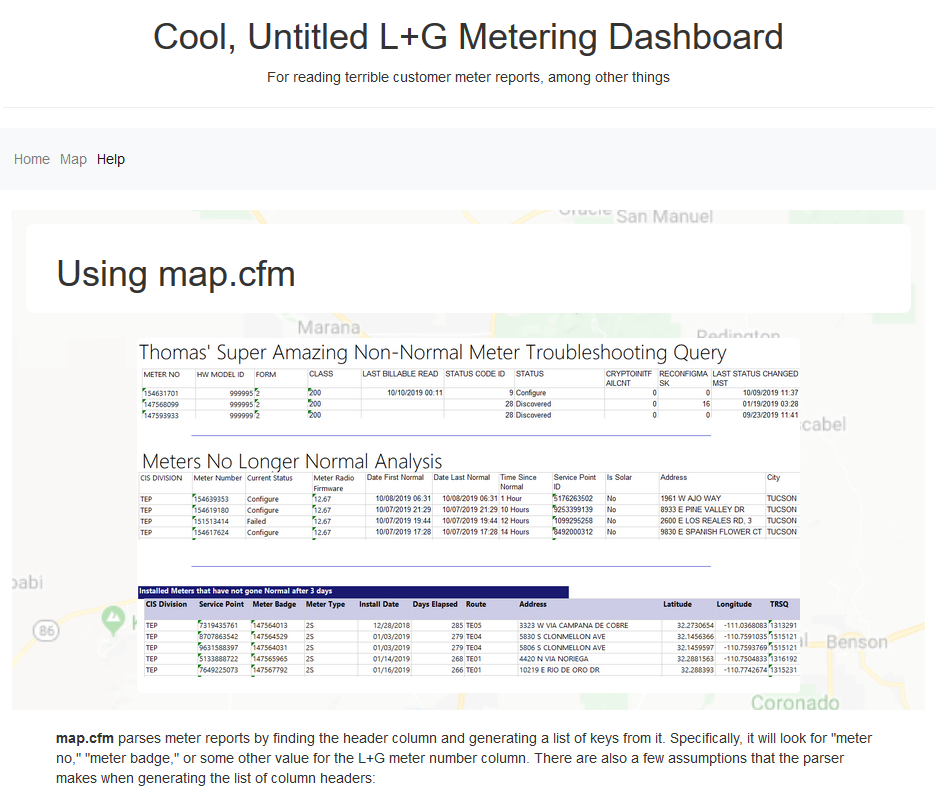

# A Dashboard for Meter Reports and Other L+G Things

This is the start of a Lucee server based web application for creating useful things to support L+G TIE/TIM activities. This project utilizes ColdFusion (CF), Lucee Server, and JavaScript to implement a meter mapping tool as of 12/01/2019. Hopefully, this will serve as a platform for other modules.

## Usage

Information on usage can be found in-app once the repository has been installed on Lucee server under the "Help" page. More module-specific information, such as billing information for modules that use paid APIs, can be found in the [module-docs](./module-docs) section.

  

## Installation

This project runs on [Lucee](https://download.lucee.org/). To use the modules here, clone this repository into your Lucee ROOT directory. Specific information on installing each module and troubleshooting bugs can be found in the [module-docs](./module-docs) section.

## Roadmap / Finding Help

The point of this repository is to be expandable to different CFML projects developed in the future. Here is a list of useful resources related to CFML and other concepts used here:

* [CFDocs](https://cfdocs.org/) is great for quickly referencing CF concepts and is full of useful example code in both markup and script format.
* [Learn CF In A Week](http://www.learncfinaweek.com/) is good for complete CF beginners.
* [This Tomcat Training GitHub](https://github.com/apache/tomcat-training) for learning more about the inner-workings of the Apache Tomcat server Lucee is based on
* [W3Schools](https://www.w3schools.com/) for HTML, CSS, JavaScript, & more (with lots of examples and demo modules)

More references and guides can be found in the [module-docs](./module-docs) as well.

