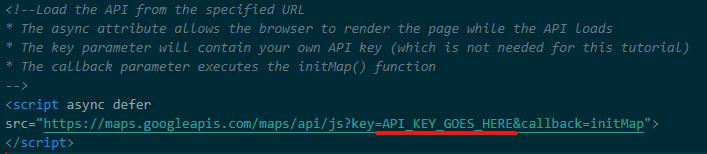
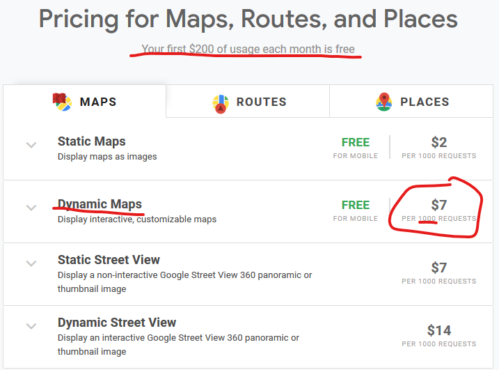

# map.cfm

Parses Excel (.xlsx) meter reports and maps meters with the Google Maps API. Useful for mapping meter reports from self-hosted customers.

## Setup / Installation

To parse excel spreadsheets with CF in Lucee, you'll first need to clone or copy the [lucee-spreadsheet](https://github.com/cfsimplicity/lucee-spreadsheet) library into your ROOT directory and **rename the folder to "spreadsheetLibrary"**. More usage details can be found on the library's GitHub page.

**map.cfm** maps reports with [Google Maps API](https://developers.google.com/maps/documentation). In order to run use Google Maps on **map.cfm**, you'll need to generate an API key and paste it in the relevant section as shown below.

  

## Google Developers Setup

To generate API keys, you'll need a Google account to access the [Google Developer Console](https://developers.google.com/). Once an account is created, create a new project that uses Google Maps JavaScript API and generate a Google Maps API key. 

## Google Maps Billing

  

**map.cfm** uses Dynamic Maps and was tested using a personal account, and the image above shows pricing quoted for an individual user. 

* Individual users that create new Google Maps projects have a 65-day free trial of up to $300 credit.
* Billing occurs monthly and is based on requests-per-month.
* The design and testing phase, **map.cfm** generated 749 Dynamic Maps requests ($5.25).
* There is a $200 credit applied each month, equivalent to 28,571 free requests per month; for most users, **Google Maps API is essentially free**.

For more information on Google Maps platform billing, please refer to [Google's GMP Billing documentation](https://developers.google.com/maps/billing/gmp-billing).